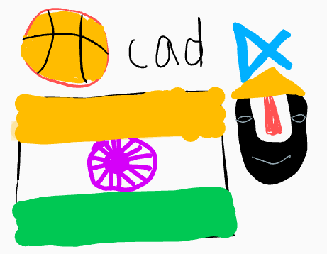

<html>
<head>
    <meta charset="UTF-8">
    <meta name="viewport" content="width=device-width, initial-scale=1.0">
    <title>Your Page Title</title>
    
</head>
<body>

<h1 id="-u-font-size-100px-style-color-blue-tanav-s-page-font-u-"><strong><u>~Tanav&#39;s Page~</u></strong></h1>

Go to my <a href="https://github.com/Swaggerplayer33">Github account</a>

<h2 id="-strong-style-color-blue-here-is-my-freeform-image-strong-"><strong  style="color:blue">  Here is my freeform image!</strong></h2>

Here are some fun facts about me!

<table>
<thead>
<tr>
<th>1. I enjoy playing basketball with my friends</th>
<th>2. I like to play the piano</th>
</tr>
</thead>
<tbody>
<tr>
<td>3. My favorite food is pizza</td>
<td>4. My favorite animals are birds</td>
</tr>
<tr>
</tr>
<tr>
<td>5. I was born in India</td>
<td>6. In my free time I play video games</td>
</tr>
</tbody>
</table>
<h2 id="-strong-style-color-blue-i-love-spending-time-in-nature-strong-"><strong style="color:blue">  I love spending time in nature!</strong></h2>

<h2 id="-span-style-color-red-overview-of-hacks-study-and-tangibles-span-">Overview of Hacks, Study and Tangibles</h2>

Blogging in GitHub pages is a way to learn and code at the same time. 

<ul>
<li>Plans, Lists, <a href="https://clickup.com/blog/scrum-board/">Scrum Boards</a> help you to track key events, show progress and record time.  Effort is a big part of your class grade.  Show plans and time spent!</li>
<li><a href="https://levelup.gitconnected.com/six-ultimate-daily-hacks-for-every-programmer-60f5f10feae">Hacks(Todo)</a> enable you to stay in focus with key requirements of the class.  Each Hack will produce Tangibles.</li>
<li>Tangibles or <a href="https://en.wikipedia.org/wiki/Artifact_(software_development">Tangible Artifacts</a>) are things you accumulate as a learner and coder. </li>
</ul>
</body>
</html>

